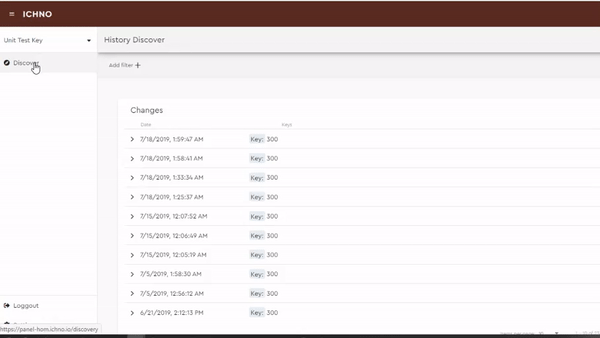
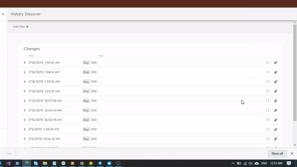
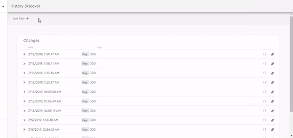

Discover View
=============

With Discover View you can filter versions, view the changes, the posted json instance and navigate through a change chain.

Changes Tree
^^^^^^^^^^^^

In changes tree view you can navigate through all posted versions and their labels and metadata.

Json Version
^^^^^^^^^^^^

With json view, you can see the json of the instance posted to register the version.

Chain View
^^^^^^^^^^

In chain view, you can navigate through versions from the same instance and see the changes made on properties.

Quering Versions
^^^^^^^^^^^^^^^^

Using filters you can filter by keys, labels and properties values. Use multiple filters to look for the exact instance that you want.
