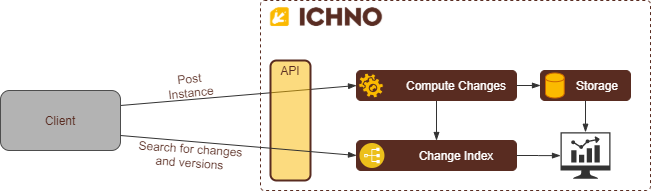

General View
============

API
===

Ichno provides an API to be used to integrate easily with. The swagger definition can be accessed |swagger|.
Remember that you need an API Key to communicate, even using the Swagger Interface.

.. |swagger| raw:: html

   <a href="https://api.ichno.io/swagger/index.html" target="_blank">here</a>

API Key
-------

To post and query versions, you need to send your api-key through the header, in the ``X-API-KEY`` entry. You can see how to manage your keys at `Api Keys <../admin/admin.html#api-keys>`__. 

Posting Versions
----------------

Two endpoints to register instance versions is provided:

| 1. **Asynchronous Post** ``POST /api/v1/version/async``
| Using this endpoint, the api will response almost instantly, and the version will be processed asynchronously, and will be ready to be queried in few seconds.

| 2. **Synchronous Post** ``POST /api/v1/version``
| Using this endpoint, the version will be processed synchronously with a bigger response time. Use this endpoint if you need this versions ready to be queried right after the register post response.

Post Struct
^^^^^^^^^^^

More than only your object instance, you can send other fields to store aditional information about the posted version?

.. list-table::
    :widths: 15 15 15 55
    :width: 100
    :header-rows: 1

    * - Field
      - Type
      - Required
      - Description
    * - id
      - ``UUID``
      - **Yes**
      - | The identifier for this version. 
        | This id must be generated by client. It allows the client application to refer to the posted version, in a asynchronous scenario, even if is not processed by Ichno yeat.
    * - object
      - ``object``
      - **Yes**
      - | The instance to be register. 
        | Send the current state of this instance, after all changes applied. Ichno will compare with the version registered previously and compute all changes.
    * - metadata
      - ``object``
      - No
      - | Additional data to this version. 
        | Use this field to add some additional data to your version. The values in this field **cannot** be queried, but can be retrieved when you need.
    * - keys
      - | ``[string]: string | number | boolean``
        | (Key Value List)
      - **Yes**
      - | Unique identifier of the instance in the clients system. 
        | Send the id's of this instance. It is a list to allow sending objects with composite keys. If you are registering versions from diferent instance types, you must send a type identifier as a key too, to avoid conflicts between too instances, with diferent types and same identifier.
    * - labels
      - | ``[string]: string | number | boolean``
        | (Key Value List)
      - **No**
      - | Version label. 
        | Send labels to this version. Labels are additional data for this version but, diferent from metadate, these labels can be used as a filter. You can use this, for example, to send the user id who is changing the instance, enabling you to filter all changes made by a specific user.   

Quering Changes
---------------

After have your instance versions registered, it is possible to query changes using the following parameters:

+------------+------------+-----------+
| Header 1   | Header 2   | Header 3  |
+============+============+===========+
| body row 1 | column 2   | column 3  |
+------------+------------+-----------+
| body row 2 | Cells may span columns.|
+------------+------------+-----------+
| body row 3 | Cells may  | - Cells   |
+------------+ span rows. | - contain |
| body row 4 |            | - blocks. |
+------------+------------+-----------+

.. list-table:: Title
   :widths: 25 25 50
   :header-rows: 1

   * - Heading row 1, column 1
     - Heading row 1, column 2
     - Heading row 1, column 3
   * - Row 1, column 1
     -
     - Row 1, column 3
   * - Row 2, column 1
     - Row 2, column 2
     - Row 2, column 3

.. list-table::
   :widths: 15 15 15 55
   :width: 100
   :header-rows: 1

   * - Field
     - Type
     - Required
     - Description
   * - keys
     - | ``[string]: string | number | boolean``
       | (Key Value List)
     - **No**
     - | Unique identifier of the instance in the clients system. Use the same values used to register the instance. If you are using composite keys, its possible to send all keys or a subset of these keys.
   * - startDate
     - | ``date``
       | (yyyy-MM-ddThh:mm:ss)
     - **No**
     - | Start date for date range.
   * - endDate
     - | ``date``
       | (yyyy-MM-ddThh:mm:ss)
     - **No**
     - | End date for date range.
   * - labels
     - | ``[string]: string | number | boolean``
       | (Key Value List)
     - **No**
     - | Change labels.
   * - properties
     - | ``object``
     - **No**
     - Filter changes by properties
   * - start
     - | ``integer``
     - **No**
     - Number of register to skip on this query. Useful to pagination.
   * - length
     - | ``integer``
     - **No**
     - Number of register that must be returned. Useful to pagination.

Query by properties
^^^^^^^^^^^^^^^^^^^

Ichno also allow you to query by properties, allowing you to query changes made on specific property. Properties query parameters are send through an object in the property ``properties`` on change query endpoint:

.. list-table::
    :widths: 15 15 15 55
    :width: 100
    :header-rows: 1

    * - Field
      - Type
      - Required
      - Description
    * - path
      - | ``[string | number | boolean]``
        | (array)
      - **No**
      - | Property path. 
        | For example, if you are registering version for the following object:
          
          ..  code-block:: javascript

              {
                name: 'John Hanson',
                address: {
                  street: 'The Great, Ave',
                  number: 153
                }
              }
          
        | You can query the name changes using the following array as parameter:
        | ``['name']``
        | Or this one to filter by street name changes:
        | ``['address', 'street']``
    * - newValue
      - | ``string | number | boolean``
      - **No**
      - | Filter properties by the new value.
    * - oldValue
      - | ``string | number | boolean``
      - **No**
      - | Filter properties by the old value.

